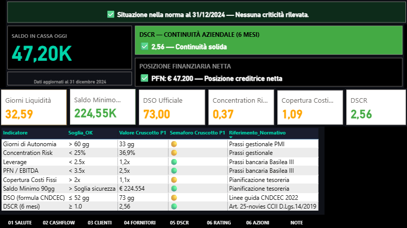
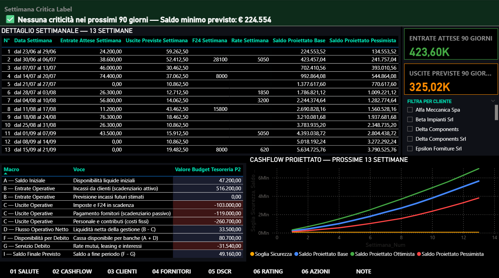
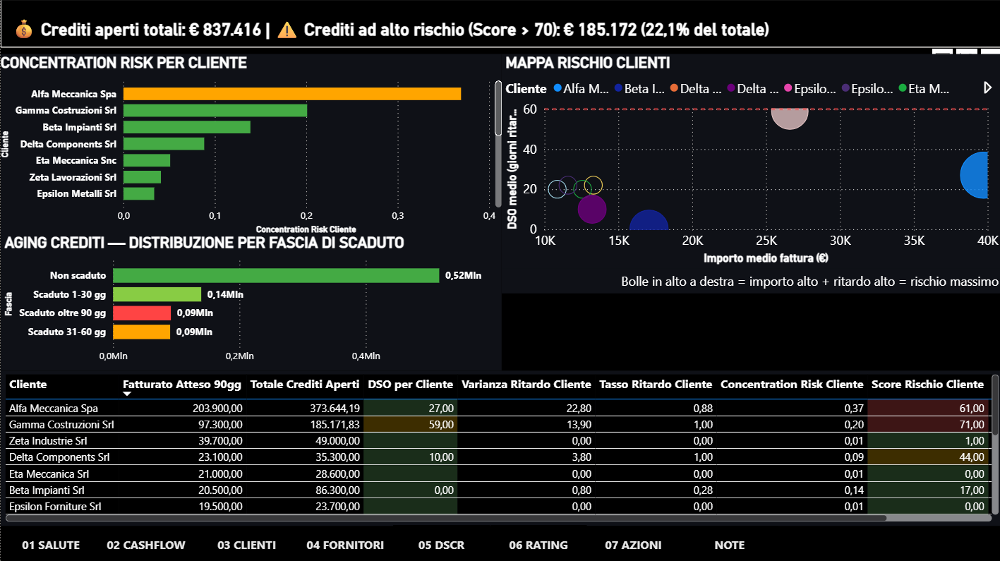
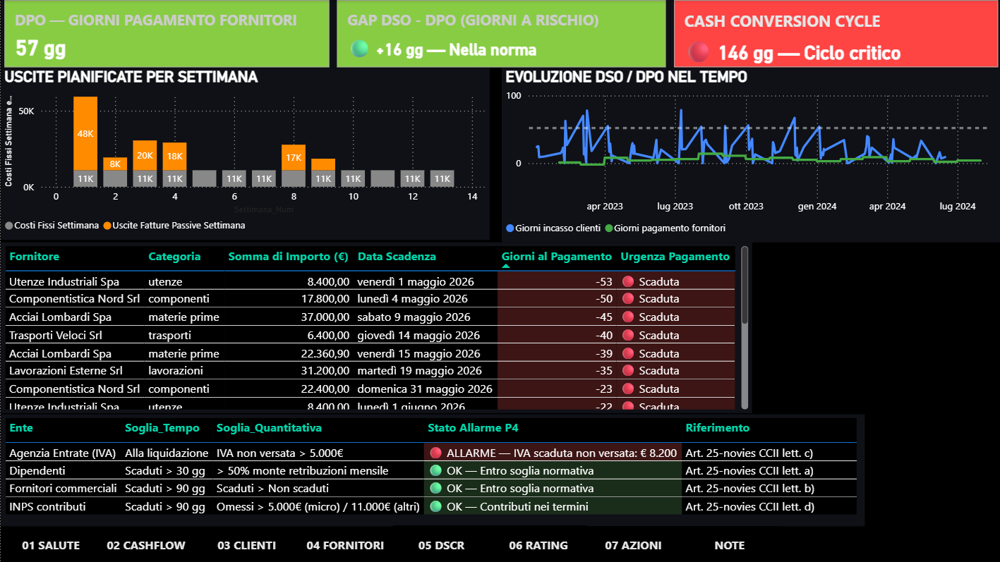
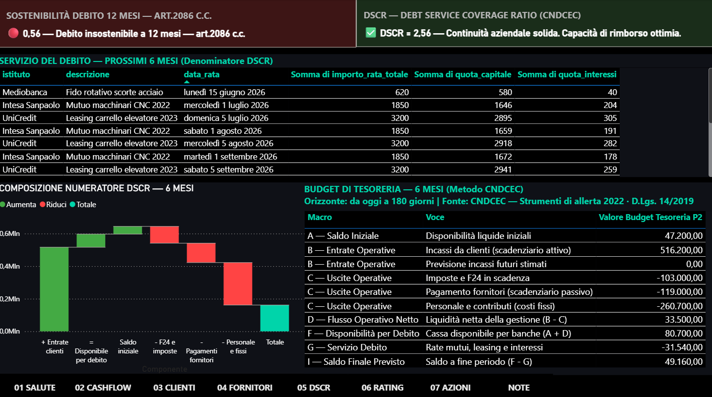
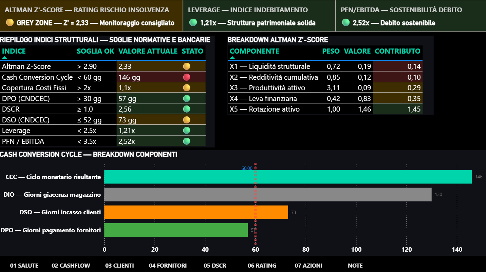
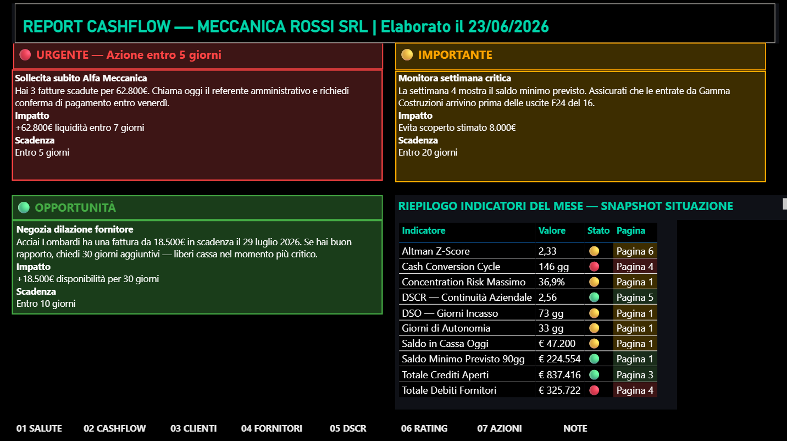

# Cash Intelligence Dashboard for Italian SMEs

[]()
[]()
[]()

> **Automated liquidity monitoring, credit risk scoring and 13-week cash
> forecasting for Italian manufacturing SMEs — from raw ledgers to a
> prioritised monthly action list. Compliant with D.Lgs. 14/2019.**

---

## About This Project

This is a portfolio project demonstrating applied **FP&A and Treasury
Management** competencies through a real-world financial problem:
Italian manufacturing SMEs routinely run profitable P&Ls while facing
liquidity crises — because nobody is measuring cash forward,
only backward.

I designed and built a complete financial intelligence system in Power BI
that transforms raw operational data (AR, AP, bank statements, tax
schedule, loan amortisation) into a structured monthly cash report —
updated automatically, no manual spreadsheet work.

**The target:** SME finance directors and business owners who need cash
visibility 90 days ahead, not 30 days behind.
**The stack:** Power BI Desktop — data modelling, DAX calculations,
automated scenario engine.
**The dataset:** Synthetic — Meccanica Rossi Srl, simulated Italian
manufacturing company, €1.8M revenue, 14 employees.

---

## Screenshots

### Page 1 — Financial Health Monitor



*Eight normative KPIs with traffic-light logic.
Four indicators in amber — visible the moment the report opens.*

### Page 2 — 13-Week Cash Forecast



*Three simultaneous scenarios. Weekly granularity.
Tax payments and loan repayments from the real schedule — not estimates.*

### Page 3 — Client & Credit Risk



*Concentration risk, AR aging, and a composite credit score per customer.
The largest customer (37% of the book) and the highest-risk customer
(score 71/100) are two different names.*

### Page 4 — Suppliers & Working Capital



*DPO, the DSO–DPO gap, and a 146-day cash conversion cycle — plus the four
Art. 25-novies early-warning signals, one already triggered on VAT.*

### Page 5 — DSCR & Regulatory Compliance



*The six-month DSCR (2.56 ✅) and the twelve-month sustainability test
(0.56 🔴) on the same screen. Same company, same debt — the only variable
is the horizon.*

### Page 6 — Predictive Scoring



*Altman Z'-Score 2.33 — grey zone — decomposed into its five weighted
components, alongside eight structural indices measured against regulatory,
banking and academic benchmarks simultaneously.*

### Page 7 — Prescriptive Recommendations



*Three prioritised actions. Each with a named counterparty, a quantified
euro impact, and a deadline. This month's headline: one customer, three
overdue invoices, €62,800 — collectable inside a week.*

---

## Business Value

This system enables management to:

- **Anticipate liquidity shortfalls** up to 90 days before they become
  payment failures — including the specific week they occur
- **Plan around fixed obligations** (tax deadlines, loan repayments)
  from a structured forward schedule instead of discovering them
  last minute
- **Model payment risk** across three scenarios — optimistic, realistic,
  and stress — each measured against a minimum safety threshold
- **Monitor eight financial health indicators** against regulatory and
  banking benchmarks in real time, not at quarter-end
- **Prioritise receivables collections** based on which customers carry
  the highest combination of delay risk and portfolio exposure
- **Separate customer size from customer risk** — rank the receivables
  book by payment behaviour, not revenue, and measure how much of it
  sits in the high-risk tier
- **Locate where cash is trapped** — decompose the 146-day cash conversion
  cycle to distinguish the collection-vs-payment gap from the
  inventory-holding period
- **Catch regulatory triggers automatically** — monitor the four
  Art. 25-novies CCII early-warning signals, flagging breaches
  (e.g. VAT arrears) the month they cross the statutory threshold
- **Test debt coverage across two horizons** — the regulatory six-month
  DSCR on the prescribed cash-budget structure, and the twelve-month test
  the board owes under Art. 2086 c.c. — surfacing the divergence instead
  of reporting only the flattering number
- **Score insolvency risk and locate the lever** — an Altman Z'-Score
  decomposed into five weighted components, showing which ratio repays
  effort fastest rather than merely issuing a verdict
- **Convert analysis into a monthly action list** — every indicator resolved
  into at most three prioritised recommendations, each with a named
  counterparty, a euro impact, and an execution deadline

**The core insight this project surfaces:**

A business can show DSCR 2.56 (debt fully covered for 6 months)
and only 32 days of liquidity runway — simultaneously.
Standard reporting shows one. This system shows both.

**A second insight — the AR/AP module:**

The largest customer and the riskiest customer are not the same name.
The biggest account holds 37% of the receivables portfolio; the highest
risk score (71/100) belongs to a smaller, chronically late-paying
customer. Ranking by revenue would flag neither correctly.

**A third insight — the compliance module:**

Debt coverage at six months is 2.56. Debt sustainability at twelve months
is 0.56. Same company, same debt — the only variable is the horizon.
The horizon is not a parameter of the calculation. It is the calculation.

---

## My Role

I designed and built this project end-to-end, independently:

**Financial design:**
- KPI selection and normative benchmark framework
- 13-week rolling forecast methodology and scenario logic
- Cash budget structure (CNDCEC Budget di Tesoreria methodology)
- Credit risk scoring model for AR portfolio
- Receivables concentration and aging framework
- Working capital cycle analysis (DSO, DPO, DIO, Cash Conversion Cycle)
- DSCR methodology and 12-month debt sustainability test (Art. 2086 c.c.)
- Altman Z'-Score adaptation for non-listed Italian SMEs, with component
  decomposition and improvement-lever analysis
- Prescriptive recommendation framework — priority tiers, monetary impact
  quantification, execution deadlines

**Technical execution:**
- Star schema data model in Power BI Desktop
- Data preparation and normalisation pipeline
- Scenario calculation engine with cumulative rolling logic
- Two-dimensional risk mapping (customer exposure × payment delay)
- Waterfall decomposition of the DSCR numerator
- Rule-based recommendation engine with hierarchical priority tiers
- Cross-page snapshot index with source-page drill references
- Conditional alert system with hierarchical priority logic
- Seven-page dashboard with executive and analyst-level views

**Financial compliance:**
- Alignment of DSO/DPO formulas to CNDCEC official methodology
- DSCR calculation structure per D.Lgs. 14/2019
- Art. 25-novies four-signal early-warning monitoring
  (VAT, INPS, payroll, trade suppliers)

---

## Key Skills Demonstrated

| Financial | Technical |
|-----------|-----------|
| Cash Flow Forecasting (13-week) | Power BI — data modelling and DAX |
| Financial Planning & Analysis (FP&A) | Star Schema architecture |
| Treasury Management | Scenario engine design |
| Scenario Analysis (3-model) | Conditional logic and alert systems |
| Working Capital Management | Power Query — data preparation |
| Credit Risk Scoring | Data visualisation |
| KPI Design and Benchmarking | Automated refresh pipeline |
| Regulatory Compliance (Italian CCII) | Business Intelligence |
| Altman Z'-Score Modelling | Financial data architecture |
| Prescriptive Analytics & Decision Support | Rule-based recommendation engine |

---

## System Overview — 7 Pages

| Page | Focus | Core Output | Methodology |
|------|-------|-------------|-------------|
| 01 HEALTH | Real-time financial monitoring | 8-KPI dashboard with normative benchmarks | [Module 1](methodology/module1_liquidity_forecast.md) |
| 02 CASHFLOW | Forward-looking cash projection | 13-week forecast + cash budget structure | [Module 1](methodology/module1_liquidity_forecast.md) |
| 03 CLIENTS | AR risk analysis | Concentration risk, aging, credit score | [Module 2](methodology/module2_risk_analysis.md) |
| 04 SUPPLIERS | AP management + working capital | DPO, Gap DSO-DPO, CCC, Art. 25-novies | [Module 2](methodology/module2_risk_analysis.md) |
| 05 DSCR | Regulatory compliance | DSCR, 12-month sustainability test | [Module 3](methodology/module3_compliance_scoring.md) |
| 06 RATING | Predictive financial scoring | Altman Z'-Score, Leverage, PFN/EBITDA | [Module 3](methodology/module3_compliance_scoring.md) |
| 07 ACTIONS | Prescriptive recommendations | Monthly action list with monetary impact | [Module 3](methodology/module3_compliance_scoring.md) |

---

## Methodology Documentation

Full analytical documentation — formulas, thresholds, design decisions and
known limitations — is published for all seven pages:

| Module | Pages | Contents |
|--------|-------|----------|
| **[Module 1 — Liquidity & Forecasting](methodology/module1_liquidity_forecast.md)** | 1 · 2 | Liquidity runway · 8 health KPIs · 13-week scenario engine · CNDCEC cash budget |
| **[Module 2 — AR/AP Risk & Working Capital](methodology/module2_risk_analysis.md)** | 3 · 4 | Concentration risk · Composite credit scoring · DSO / DPO / CCC · Art. 25-novies signals |
| **[Module 3 — Compliance, Scoring & Actions](methodology/module3_compliance_scoring.md)** | 5 · 6 · 7 | DSCR · 12-month sustainability · Altman Z'-Score decomposition · Prescriptive engine |

---

## Data Architecture

```
[Raw Data Sources]
        │
        ├── Accounts Receivable ledger (AR)
        ├── Accounts Payable ledger (AP)
        ├── Bank statement — running balance
        ├── Tax payment schedule (F24)
        ├── Loan amortisation plan
        └── Annual accounts (balance sheet + P&L)
        │
[Preparation Layer — Power Query]
  Normalise formats · Align date types · Scale corrections
        │
[Data Model — Star Schema]
  Fact tables connected to shared date dimension
  Isolated support tables for scenario and KPI logic
        │
[Calculation Engine — DAX]
  Forecast scenarios · KPI measures · Alert conditions · Scoring
        │
[Dashboard — 7 Pages]
  Executive view (health) → Operational detail → Prescriptive output
```

**Key architectural decision:** Forecast tables are intentionally
isolated from the date dimension. This prevents automatic filter
propagation and gives the scenario engine full control over date
logic — essential for cumulative rolling cash calculations.

---

## Analytical Methodology — Module 1 (Pages 1 + 2)

### Liquidity Runway

```
Liquidity Runway = Cash Balance / (Monthly Fixed Costs / 30)
```

| Range | Status | Decision |
|-------|--------|----------|
| > 60 days | ✅ Green | Safe |
| 30–60 days | ⚠️ Amber | Monitor |
| < 30 days | 🔴 Red | Act immediately |

**Test result: 32 days → Amber**

### 13-Week Rolling Forecast — Scenario Logic

| Scenario | Receivables | Payables |
|----------|------------|---------|
| Optimistic | Collected on due date | Fixed weekly schedule |
| Base | Due date + historical delay per customer | Fixed weekly schedule |
| Pessimistic | Due date + delay + 30-day stress | Fixed weekly schedule |

Payables are invariant across all scenarios — suppliers, tax
authorities, and banks do not extend delays because a customer
is late paying.

**Outflows explicitly scheduled (not averaged):**
AP from invoice ledger · Payroll · F24 tax payments ·
Loan repayments

**Known limitation — revenue horizon:**
Invoice-based inflows cover 30–60 days of forward visibility.
For weeks 7–13, the current model relies on synthetic data
with pre-distributed invoices. In a live implementation,
integration with the customer order backlog (portafoglio ordini)
is required to extend revenue visibility across the full
13-week horizon. This is identified as the primary
development priority for the next release.

**Known limitation — stress test granularity:**
The current stress scenario applies a uniform 30-day delay
across all customers. A more sophisticated implementation
would weight the stress by customer credit score — customers
in higher-risk tiers receive larger delay assumptions.
This improvement is planned for integration with the
credit risk module (Page 3).

### Cash Budget — 6-Month Structure (CNDCEC Budget di Tesoreria)

```
A  Opening cash balance
B  Operative inflows       (AR — 6 months)
C  Operative outflows      (AP + Payroll + Tax — 6 months)
D  Net operative flow      = B – C
F  Available for debt      = A + D
G  Debt service            (loans + leasing — 6 months)
I  Closing balance         = F – G

DSCR = F ÷ G  |  Threshold: ≥ 1.0 (D.Lgs. 14/2019)
```

**Methodology source:** CNDCEC "Strumenti di allerta" 2022 —
Budget di Tesoreria approach, recommended for SMEs with
structured accounting systems.

**Test result: DSCR 2.56 ✅ — 12-month sustainability: 0.56 🔴**

---

## Analytical Methodology — Module 2 (Pages 3 + 4)

### Concentration & Credit Risk

Concentration risk measures each customer's share of total receivables
exposure, benchmarked against a prudential ceiling:

```
Concentration Risk = Customer receivables exposure / Total portfolio exposure
```

| Range | Status | Decision |
|-------|--------|----------|
| < 25% | ✅ Green | Diversified |
| 25–40% | ⚠️ Amber | Monitor closely |
| > 40% | 🔴 Red | Critical dependency |

**Test result: top customer at 37% → Amber.** More than a third of the
book on one counterparty; a 30-day delay from that account alone would
collapse the 32-day runway from Module 1.

### Composite Credit Score — Size Is Not Risk

Each customer receives a single 0–100 risk score blending payment
slowness, payment reliability (delay frequency), payment volatility
(delay variance), and portfolio exposure (concentration, acting as an
amplifier). The design principle:

| Customer | Concentration | Avg. payment delay | Composite score |
|----------|---------------|--------------------|-----------------|
| Alfa Meccanica (largest) | 37% | 27 days | 61 |
| Gamma Costruzioni (smaller) | 20% | 59 days | **71** |

The biggest customer is not the riskiest. Aggregated, receivables in the
high-risk tier (score > 70) total **€185,172 — 22.1% of the open book.**

Customers with no payment history are returned as **unscored (blank),
not zero** — a delay of 0 would falsely rank the least-known customers
as the safest.

### Working Capital — Cash Conversion Cycle

```
CCC = DSO + DIO − DPO = 73 + 130 − 57 = 146 days
```

**Test result: 146 days → Critical.** The naïve gap (DSO − DPO = +16 days)
reads *within norm*. The CCC reveals the real driver: **inventory
(≈130 days),** not the collection-payment gap. Cash is committed when
materials are bought and recovered almost five months later — the
structural reason a profitable business (DSCR 2.56) holds only 32 days
of runway.

### Art. 25-novies CCII — Early Warning

Four statutory early-warning signals monitored automatically:

| Creditor | Threshold | Reference | Status |
|----------|-----------|-----------|--------|
| Employees (payroll) | > 30 days overdue, > 50% monthly payroll | lett. a) | ✅ |
| Trade suppliers | > 90 days overdue, overdue > current | lett. b) | ✅ |
| Revenue Agency (VAT) | Unpaid VAT > €5,000 | lett. c) | 🔴 |
| INPS | > 90 days, omitted > €5,000 / €11,000 | lett. d) | ✅ |

**Triggered: unpaid VAT €8,200 > €5,000 threshold** — a formal
early-warning signal under CCII, surfaced automatically the month it
crosses the line.

---

## Analytical Methodology — Module 3 (Pages 5 + 6 + 7)

### DSCR — The Regulatory Test

The CNDCEC prescribes the Budget di Tesoreria as the instrument for
computing the DSCR used in early-warning assessment:

```
A  Opening cash balance                      €47,200
B  Operative inflows (AR, 6 months)         €516,200
C  Operative outflows                      −€482,700
D  Net operative flow       (B − C)          €33,500
F  Available for debt       (A + D)          €80,700
G  Debt service (loans, leasing, interest)  −€31,540
I  Projected closing balance (F − G)         €49,160

DSCR = F ÷ G = 2.56 ✅    Threshold: ≥ 1.0
```

The separation of operative outflows (C) from debt service (G) is
methodological, not cosmetic: it ensures the numerator represents true
operative cash generation rather than a figure distorted by treating loan
repayments as operating costs. Debt service is read from the real
amortisation schedule of three instruments — capital and interest split
per instalment, not a flat annual average.

### The Horizon Effect

| Test | Horizon | Result | Verdict |
|------|---------|--------|---------|
| DSCR | 6 months | **2.56** | ✅ Debt covered |
| Sustainability (Art. 2086 c.c.) | 12 months | **0.56** | 🔴 Structurally at risk |

The six-month window is flattered by an invoice backlog that populates the
near horizon densely. Push out to twelve months and the backlog thins —
while payroll, tax and debt service run at full weight regardless. Both
figures are correct; reporting only the first would be technically
compliant and analytically misleading.

### Altman Z'-Score — Decomposed

```
Z' = 0.717·X1 + 0.847·X2 + 3.107·X3 + 0.420·X4 + 0.998·X5
```

| Component | Coefficient | Value | Contribution |
|-----------|-------------|-------|--------------|
| X1 — Working capital / Assets | 0.717 | 0.19 | 0.14 |
| X2 — Retained earnings / Assets | 0.847 | 0.12 | 0.10 |
| X3 — EBIT / Assets | **3.107** | **0.09** | 0.29 |
| X4 — Equity / Liabilities | 0.420 | 0.83 | 0.35 |
| X5 — Sales / Assets | 0.998 | 1.46 | 1.45 |
| | | **Z' =** | **2.33 🟡** |

**Result: 2.33 → Grey Zone** (safe zone > 2.90).

A score is a verdict; the decomposition is a plan. X5 *carries* the score
— 1.45 of 2.33, some 62% of the total. X3 is the *lever*: the company's
weakest ratio paired with the heaviest coefficient, so every 0.01 of
improvement is worth 3.1× the same gain in X5. And because X3 and X5 share
a denominator — total assets — the inventory reduction identified in
Module 2 lifts both at once.

### Prescriptive Analytics — 8 Indicators, 3 Decisions

Every recommendation carries four mandatory elements: a **named
counterparty**, a **concrete verb**, a **quantified euro impact**, and a
**deadline**. Without all four it is an observation, not a recommendation.

| Tier | This month | Impact |
|------|-----------|--------|
| 🔴 Urgent | Chase Alfa Meccanica — 3 overdue invoices | +€62,800 within 7 days |
| 🟡 Important | Monitor week 4 — collection vs F24 collision | Avoids ~€8,000 overdraft |
| 🟢 Opportunity | Negotiate Acciai Lombardi deferral | +€18,500 headroom for 30 days |

Each is traceable to the page that produced it. The six analytical pages
are not the deliverable — they are the evidence base for the seventh.

**Full methodology:** [module3_compliance_scoring.md](methodology/module3_compliance_scoring.md)

---

## Key Results — Test Dataset

**Liquidity**

| Metric | Value | Status | Benchmark |
|--------|-------|--------|-----------|
| Liquidity Runway | 32 days | ⚠️ | > 60 days |
| Opening cash balance | €47,200 | ⚠️ | — |
| 90-Day Minimum Balance | €224,554 | ✅ | > Safety threshold |
| 90-Day Expected Inflows | €423,600 | ✅ | — |
| 90-Day Expected Outflows | €325,020 | — | — |

**Debt & regulatory compliance**

| Metric | Value | Status | Benchmark |
|--------|-------|--------|-----------|
| DSCR (6 months) | 2.56 | ✅ | ≥ 1.0 |
| 12-Month Sustainability | 0.56 | 🔴 | ≥ 1.0 |
| 6-Month Net Closing Balance | €49,160 | ✅ | > 0 |
| Art. 25-novies signals triggered | 1 of 4 — VAT €8,200 | 🔴 | 0 |

**Working capital & credit risk**

| Metric | Value | Status | Benchmark |
|--------|-------|--------|-----------|
| DSO (CNDCEC) | 73 days | ⚠️ | ≤ 52 days |
| DPO (CNDCEC) | 57 days | ✅ | > 30 days |
| Cash Conversion Cycle | 146 days | 🔴 | < 60 days |
| Total open receivables | €837,416 | — | — |
| High-risk receivables (score > 70) | €185,172 — 22.1% | ⚠️ | — |
| Concentration Risk (top client) | 36.9% | ⚠️ | < 25% |

**Structural scoring**

| Metric | Value | Status | Benchmark |
|--------|-------|--------|-----------|
| Altman Z'-Score | 2.33 | 🟡 | > 2.90 |
| Leverage | 1.21× | ✅ | < 2.5× |
| PFN / EBITDA | 2.52× | ✅ | < 3.5× |
| Fixed Cost Coverage | 1.1× | ⚠️ | > 2× |
| Health indicators in amber (Page 1) | 4 of 8 | ⚠️ | — |
| Structural indices (Page 6) | 4 ✅ · 3 ⚠️ · 1 🔴 | ⚠️ | — |

**The analytical tension this project is designed to surface:**
A business with DSCR 2.56 (solid debt coverage at 6 months)
holds only 32 days of liquidity runway.
Both are true simultaneously.
The CCC of 146 days structurally explains this gap —
cash is tied up in inventory and receivables, not in the account.
Standard reporting shows the P&L. This system shows
where the cash actually is, and when it will move.

---

## Challenges & Solutions

### 1. Scenario integrity under incomplete data

**Challenge:** When customers had no historical payment data,
the base scenario used a portfolio-average delay. This caused
the pessimistic scenario (base + 30 days) to sometimes produce
higher projected balances than the base — inverting the intended
ordering of the three curves.

**Solution:** Redesigned the receivable timing logic to anchor
all scenarios to the contractual due date, not to the estimated
collection date. This guarantees Optimistic ≥ Base ≥ Pessimistic
at every data point, regardless of missing customer history.

### 2. Tax and debt data in non-standard format

**Challenge:** Source files used international decimal notation
(1850.00) in an Italian locale environment (which reads commas,
not dots, as decimal separators). The system was reading monthly
loan repayments of €1,850 as €185,000 — making the DSCR
denominator 100x too large.

**Solution:** Built a systematic scaling transformation in the
data preparation layer, applied consistently to all monetary
columns in affected source tables.

### 3. DSO/DPO methodological consistency

**Challenge:** The CNDCEC official DSO and DPO formulas require
both numerator and denominator to be VAT-inclusive — because
balance sheet receivables include VAT, but reported revenue
does not. Naively comparing open AR against revenue understates
DSO by approximately 18%.

**Solution:** Applied a 1.22 VAT multiplier to the revenue
denominator in both DSO and DPO formulas, achieving
methodological consistency with the published CNDCEC standard.

### 4. Balancing analytical depth with executive readability

**Challenge:** The same dashboard serves two different audiences
— finance-literate analysts who want to inspect the methodology,
and SME owners who want one-line answers.

**Solution:** Designed a layered structure: Page 1 provides
traffic lights and plain-language alerts; Pages 5 and 6 expose the
full normative and scoring methodology for those who want it;
Page 7 collapses everything back into three sentences.

### 5. Missing payment history producing false low-risk scores

**Challenge:** Customers with no paid-invoice history returned a
payment delay of 0, which the scoring logic read as the *best
possible* payer. This inverted the intended signal — the least-known
customers, with no track record at all, were being flagged as the
safest in the portfolio.

**Solution:** Changed the payment-behaviour measures to return
BLANK() rather than 0 when no history exists. Missing customers are
now treated as *unscored* rather than *low-risk*, keeping the score
numeric (so sorting and conditional formatting still work) while
refusing to assert a reassuring value the data does not support.

### 6. High-risk receivables filter catching no one

**Challenge:** The Page 3 banner was designed to total receivables
from "high-risk" customers, initially defined by a raw payment-delay
threshold of 60 days. But the worst-paying customer in the dataset sits
at 59 — one day under the line — so the filter captured zero receivables
and the banner reported an empty value.

**Solution:** Re-anchored the high-risk definition from a single raw
metric to the composite risk score (> 70), which captures the customer
correctly at 71. This is conceptually stronger as well as functional:
the composite reflects multiple payment dimensions, not one, and yields
a headline figure — €185,172, 22.1% of the book, sitting in the
high-risk tier.

### 7. Reconciling transactional and balance-sheet data for the CCC

**Challenge:** DSO and DPO derive from transactional ledgers (open
AR and AP invoices), but the inventory component (DIO) of the cash
conversion cycle comes from the balance sheet in the annual accounts
— a different data source at a different grain (period-end stock
versus invoice-level flow).

**Solution:** Annualised both sides to a common basis before
combining — inventory-holding days from balance-sheet stock against
cost of goods, collection and payment days from the VAT-inclusive
ledger formulas — so that DSO, DIO, and DPO sit on a consistent
365-day footing within a single CCC identity (73 + 130 − 57 = 146).

### 8. A model coefficient corrupted by locale — caught by reconciliation

**Challenge:** The Altman Z'-Score coefficient for X3 (EBIT / Total
Assets) is **3.107**. Stored in international notation and read in an
Italian locale environment, it was ingested as **3,107** — inflating the
X3 contribution by three orders of magnitude, from 0.29 to 293.30.

The dangerous part: the headline score was *not* affected. The banner
still reported Z' = 2.33 correctly. Only the component table — the part
of the dashboard that explains *why* — was wrong. No inspection of the
score itself would ever have caught it.

**Solution:** Applied the same locale-aware type conversion used for the
monetary columns (Challenge 2) to the coefficient table, and — more
importantly — introduced a standing validation rule: **the sum of the
five component contributions must equal the reported Z'-Score.** That
reconciliation is what surfaced the error, and it now runs as a permanent
check (0.14 + 0.10 + 0.29 + 0.35 + 1.45 = 2.33 ✓).

### 9. Recommendations that could not be executed

**Challenge:** The prescriptive engine proposed negotiating a payment
extension on a supplier invoice that had *already fallen due*. The
selection logic was sound — largest invoice in the tightest forecast week
— but the output was worthless: you cannot negotiate a deferral on a
payment you have already missed.

**Solution:** Added a temporal validity filter — opportunity
recommendations consider only obligations with a **future** due date,
evaluated against the report date. The underlying principle now governs
the whole prescriptive layer: a recommendation the reader cannot act on
is not a weak recommendation, it is a defect. One unexecutable line
destroys trust in every recommendation beside it.

### 10. Two horizons, opposite verdicts

**Challenge:** The six-month DSCR (2.56 ✅) and the twelve-month
sustainability test (0.56 🔴) give contradictory answers about the same
debt. The path of least resistance was to publish the metric the
regulation explicitly names — DSCR — and omit the other.

**Solution:** Publish both, side by side, with the divergence explained
rather than hidden. The six-month figure answers the regulatory question
(is there an Art. 25-novies trigger?); the twelve-month figure answers the
governance question the board actually owns under Art. 2086 c.c.
Reporting one without the other is technically compliant and analytically
misleading — which is precisely the failure mode this project was built
to expose.

---

## What I Learned

**On financial analysis:**

The Cash Conversion Cycle explains what the P&L cannot.
A manufacturing company with a 146-day CCC will always struggle
with cash — not because it is unprofitable, but because it buys
materials, processes them, invoices late, and waits.
The gap between profitability and liquidity in SMEs is structural,
not circumstantial. A DSCR of 2.56 and a liquidity runway of
32 days can coexist — and usually do.

**On working capital and risk:**

The biggest customer and the riskiest customer are rarely the same
name — size measures how much you depend on someone, behaviour
measures whether they pay. A single revenue ranking captures neither.
And the cash conversion cycle explains what the DSO–DPO gap hides:
a company can collect only 16 days slower than it pays and still trap
cash for 146 days, because inventory — not the collection gap — is
where the money actually sits. Separating these dimensions is the
difference between knowing you have a working-capital problem and
knowing where it is.

**On regulatory metrics:**

A compliance metric answers the question the regulation asks — not
necessarily the question the business needs answered. The DSCR says the
debt is covered at six months. The same company fails the twelve-month
sustainability test. Both are correct, and reporting only the flattering
one would be fully compliant. The horizon is not a detail of the
calculation; it *is* the calculation.

**On predictive scoring:**

A score is a verdict, not a plan. Altman Z' = 2.33 says the company sits
in the grey zone and says nothing about what to do. The decomposition
says it: five components, five coefficients, and arithmetic that shows
immediately which ratio repays effort. And the weights are not intuitive
— the component carrying the heaviest coefficient (3.107, operating
profit on assets) is this company's *weakest* ratio. Without the
breakdown, that is invisible.

**On forecasting:**

Single-point forecasts create false precision and overconfidence.
When management sees three scenarios simultaneously, it makes
fundamentally different decisions — particularly about when to
escalate receivables collection and when to negotiate AP
extensions. The safety threshold line is what transforms a
forecast into a decision tool.

**On data:**

In real implementations, approximately 60% of the project time goes to
data preparation — not financial modelling. Format inconsistencies,
missing fields, and naming discrepancies in source data are the rule,
not the exception. Two of the most serious errors in this project came
from the same root cause — international decimal notation read in an
Italian locale — and neither was caught by looking at the output. Both
were caught by reconciliation: a total that would not tie back, a sum of
parts that did not equal the whole. Validation rules find what
inspection misses.

**On prescriptive analytics:**

The last mile is the hardest and the most valuable. Eight indicators,
three actions. Everything the system computes exists to produce a
sentence someone can act on Monday morning: a named counterparty, a euro
amount, a deadline. Reporting ends with a number. Analysis ends with a
decision — and the gap between the two is where most financial reporting
quietly fails.

**On the normative framework:**

Italian insolvency law (CCII, D.Lgs. 14/2019) provides a
methodologically sound and practical structure for monitoring
business continuity. The Budget di Tesoreria approach is a
well-designed instrument — not just a compliance checkbox.
Understanding why regulators chose this structure helps
build better forecasting models.

---

## Dataset

All data is synthetic and generated for demonstration purposes.
No real company data is included.

| File | Content | Frequency |
|------|---------|-----------|
| `accounts_receivable.xlsx` | Customer invoices — open and paid | Monthly |
| `accounts_payable.xlsx` | Supplier invoices — open and paid | Monthly |
| `bank_movements.csv` | Bank statement + running balance | Monthly |
| `tax_schedule.xlsx` | F24 deadlines and amounts | Annual |
| `loan_amortisation.xlsx` | Loan and leasing repayment plan | Annual |
| `annual_accounts.xlsx` | Balance sheet and P&L | Annual |

---

## Project Structure

```
cash-intelligence-dashboard/
│
├── README.md
│
├── report/
│   └── cashflow_dashboard.pbix
│
├── dataset/                        ← Synthetic data only
│   ├── accounts_receivable.xlsx
│   ├── accounts_payable.xlsx
│   ├── bank_movements.csv
│   ├── tax_schedule.xlsx
│   ├── loan_amortisation.xlsx
│   └── annual_accounts.xlsx
│
├── methodology/
│   ├── module1_liquidity_forecast.md
│   ├── module2_risk_analysis.md
│   └── module3_compliance_scoring.md
│
└── docs/
    ├── screenshots/
    │   ├── page1_health.png
    │   ├── page2_cashflow.png
    │   ├── page3_clients.png
    │   ├── page4_suppliers.png
    │   ├── page5_dscr.png
    │   ├── page6_rating.png
    │   └── page7_actions.png
    └── data_architecture.md
```

---

## Intellectual Property

The calculation logic and data model powering this dashboard
are proprietary and not included in this repository.

This README and the `/methodology` folder document the
**financial framework and analytical design** — not the source code.

---

## License

Documentation and methodology: **CC BY-NC-ND 4.0**
You may read and reference this documentation for
non-commercial purposes.
Commercial use or redistribution requires written permission.

---

## Author

Diego Delbianco
Economics & Management graduate (Università di Bologna),
specialising in FP&A, Treasury Management, and Business Intelligence.

This project demonstrates applied financial modelling —
from regulatory framework design to automated dashboard
delivery and prescriptive analytics.

www.linkedin.com/in/diego-delbianco-588b32293

diegodelbianco12@gmail.com

---

*Project 1 of a four-project financial analytics portfolio:*
*Cash Intelligence Dashboard (this repository) · Credit Risk Scoring —
PD, LGD, Expected Loss · Volatility Forecasting — GARCH & Dynamic VaR ·
ML for Market Risk — PCA & Random Forest.*

*Documentation complete — all three modules published.*
